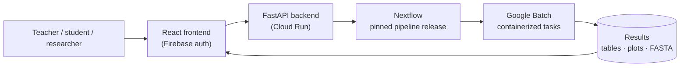

### Ethan C. Hill

I'm a bioinformatician at the **ʻIolani School Office of Community Science** in Honolulu. I build production Nextflow and Snakemake pipelines for Oxford Nanopore data, and the cloud platform that lets teachers, students, and field researchers run them without touching a terminal.

- **Pipelines:** bacterial genome assembly, eDNA species ID, and 16S microbiome profiling (Nextflow DSL2, containerized, versioned releases)
- **Platform:** a GCP web app (React, FastAPI on Cloud Run, Google Batch, Firebase auth) that runs pinned pipeline releases on demand
- **Research:** reference genomes and phylogenomics for Hawaiian biodiversity, with SDZWA, Bishop Museum, and NASA collaborators
- **Outreach:** training Hawaiʻi DOE teachers through the [ʻĀina Informatics Network](https://www.communityscience.iolani.org/ainainformatics) to bring real sequencing into classrooms

-->

---

### The pipelines

| Pipeline | What it does | Highlights |
|---|---|---|
| [**edna-ont-nf**](https://github.com/ehill-iolani/edna-ont-nf) | Taxon ID from mixed ONT eDNA amplicon pools | Modern replacement for decona: isONclust quality-aware clustering, racon/medaka consensus, BLAST with explicit no-hit/low-identity flagging so **undescribed endemic sequences aren't silently dropped** |
| [**16S-nf**](https://github.com/ehill-iolani/16S-nf) | ONT 16S rRNA microbiome profiling | Same architecture as edna-ont-nf, plus Bray-Curtis/PCoA beta diversity; shares an output schema so one frontend visualizes both |
| [**ulana-nf**](https://github.com/ehill-iolani/ulana-nf) | Bacterial whole-genome assembly and characterization | Flye → Medaka → Prokka → CheckM → AMRFinderPlus, with per-step toggles. A Nextflow port of [ulana-ht](https://github.com/ehill-iolani/ulana-ht) (Snakemake) |
| [**NovoClust**](https://github.com/ehill-iolani/NovoClust) | De novo variant discovery and abundance tracking from long-read amplicons | Clustering parameters validated against known copy numbers |

Every pipeline runs locally with Docker, Singularity, or Conda, and on **Google Batch** in the cloud.

---

### How the platform fits together

- **Pinned releases:** the platform calls a tagged version of each pipeline, so every result is reproducible and citable.
- **No cluster to babysit:** Google Batch spins compute up per job and back down afterward.
- **Least-privilege by default:** CI/CD and runtime use narrowly scoped service accounts.

---

### Tools and dashboards

- [**pwviz**](https://github.com/ehill-iolani/pwviz): public dashboard for the Paepae O Waikolu stream-biodiversity program
- [**ulana-gui**](https://github.com/ehill-iolani/ulana-gui), [**decona-gui**](https://github.com/ehill-iolani/decona-gui), [**epi2meviz-reboot**](https://github.com/ehill-iolani/epi2meviz-reboot): R Shiny front ends that made ONT tools usable in classrooms (the predecessors of the platform)

---

### Stack

**Workflows** Nextflow · Snakemake · Docker · Singularity 
**Cloud** Google Batch · Cloud Run · Firebase · GitHub Actions 
**Languages** Python · R · Bash · FastAPI · React · R Shiny 
**Genomics** Oxford Nanopore · hifiasm · Flye · Medaka · Hi-C scaffolding · BUSCO · IQ-TREE · BEAST2

---

### Elsewhere

[ResearchGate](https://www.researchgate.net/profile/Ethan-Hill-5) · Publications in *Molecular Phylogenetics and Evolution* and *Astrobiology* · Speaker, Oxford Nanopore *London Calling* 2024
